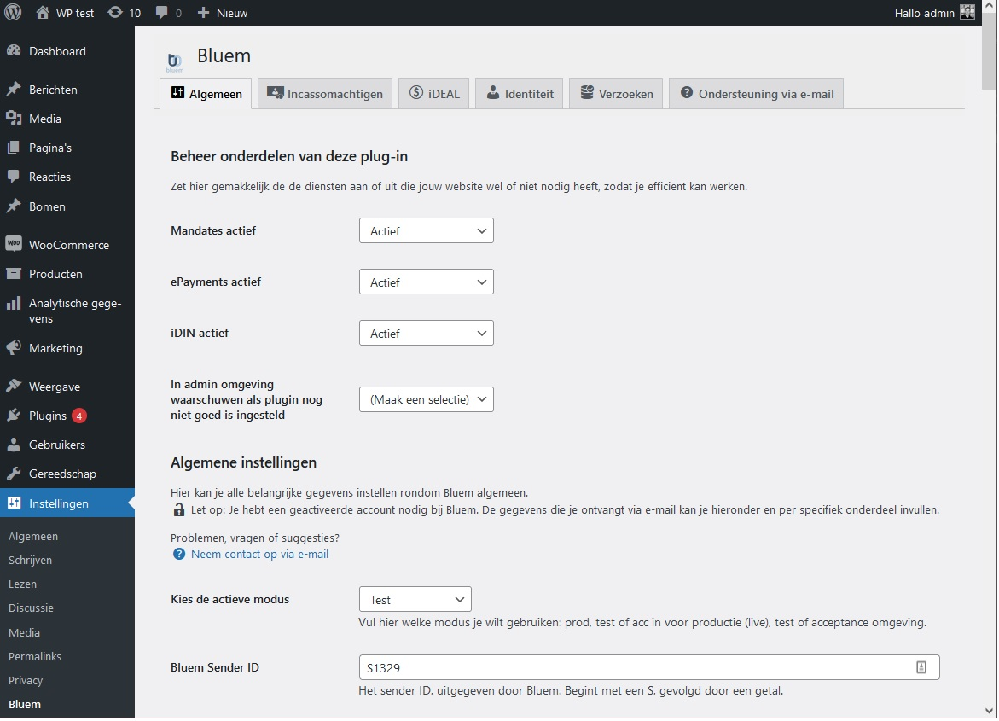

# Bluem Woo Handleiding (NL)

> Heb je tijdens of na het lezen van deze handleiding vragen of opmerkingen? 
Laat het de plug-in developers weten via email op [pluginsupport@bluem.nl](mailto:pluginsupport@bluem.nl).
 

## 📅 Belangrijke recente updates

- ⚡ **Belangrijkste wijzigingen in versie 1.3.17.5 (mei 2023)**
    - Leeftijdsverificatie per product *. 
    Dit is in te stellen via plug-in instellingen, onder ‘Identiteit’ (iDIN).
    
    * Om de functionaliteit te gebruiken dien je de iDIN service van ons af te nemen.
    Mocht je dat nog niet afnemen, neem contact met ons op: [info@bluem.nl](mailto:info@bluem.nl).

- ⚡ **Belangrijkste wijzigingen in versie 1.3.17.4 (mei 2023)**
    - Stabiliteitsverbeteringen.

- ⚡ **Belangrijkste wijzigingen in versie 1.3.17.3 (april 2023)**
    - Implementatie met onze nieuwe PHP-library.

- ⚡ **Belangrijkste wijzigingen in versie 1.3.17.2 (april 2023)**
    - Gravity Forms eMandates integratie verbeteringen.

- ⚡ **Belangrijkste wijzigingen in versie 1.3.17.1 (maart 2023)**
    - Extra velden voor Gravity Forms eMandates integratie.
    

- ⚡ **Belangrijkste wijzigingen in versie 1.3.17.0 (maart 2023)**
    - Nieuw: Gravity Forms eMandates integratie.

- ⚡ **Belangrijkste wijzigingen in versie 1.3.16.2 (januari 2023)**
    - Stabiliteitsverbeteringen.

- ⚡ **Belangrijkste wijzigingen in versie 1.3.16.1 (januari 2023)**
    - Stabiliteitsverbeteringen.

- ⚡ **Belangrijkste wijzigingen in versie 1.3.16 (december 2022)**
    - Nieuwe betaalmethoden SOFORT and Carte Bancaire toegevoegd.

- ⚡ **Belangrijkste wijzigingen in versie 1.3.15 (november 2022)**
    - Stabiliteitsverbeteringen.

- ⚡ **Belangrijkste wijzigingen in versie 1.3.14 (september 2022)**
    - Bugfix IPAPI.

- ⚡ **Belangrijkste wijzigingen in versie 1.3.13 (juli 2022)**
    - Contact Form 7 eMandates integratie *.
    
    * Om de functionaliteit te gebruiken dien je de Mandate service van ons af te nemen.
    Mocht je dat nog niet afnemen, neem contact met ons op: [info@bluem.nl](mailto:info@bluem.nl).
    - Stabiliteitsverbeteringen.

- ⚡ **Belangrijkste wijzigingen in versie 1.3.4**
    
    De plugin is nu nog stabieler! 🤖
    

- ⚡**Belangrijke wijzigingen in de versie 1.3, begin oktober 2021**
    - 📢 Er wordt een automatische email gestuurd met niet-personlijke technische informatie van foutmeldingen naar de plugin developer. Deze optie uit te schakelen in de algemene instellingen
    - 🖼️ Lay-out verbeteringen
    - 🪲 bugfix in gastgebruiker identificatie, welke niet goed werd herkend bij verlopen van de sessie in de browser.
    - 📂 Importeren en exporteren van je gehele Bluem configuratie uit je site, zodat je dit makkelijk kan overzetten naar nieuwe sites of test omgevingen.

- 📜 **Belangrijke wijzigingen in de versie 1.2.17, van 7 juli 2021**
    - De handleiding is nu ook te bereiken vanuit de plugin in de navigatiebalk.
    - Je ziet nu bij test Identeitsverzoeken zelf een interface van de bank waar je de response kan bewerken.
    - Stabiliteitsverbeteringen en vriendelijkere layout

- **📜 Belangrijke wijzigingen in de versie 1.2.16: **
    - Je kan nu een popup invullen met een toelichting op de identificatie procedure, om zo gebruikers meer te begeleiden in het proces. De tekst in de toelichting is te wijzigen via de Instellingen pagina
    - De bug dat er in de mail foutief weergeven werd dat een identificatie was voltooid, is aangepast. Nu zou dit niet meer zichtbaar moeten zijn en moet er, indien een identificatie vereist is en dit in de mail gezet is, wel juist gevuld moeten zijn.
    - Geïdentificeerde Klanten die tijdens het bestellen een account aanmaken, nemen hun identificatie mee naar hun klantaccount. Klanten die identificeren nadat ze geregistreerd zijn doen dit natuurlijk ook.
    - Doorverwijzingen na identificatie werken nu beter.
    - Bugs verholpen waarbij beschrijvingen van identiteitsverzoeken illegale karakters bevatten.
    - Stabiliteitsverbeteringen

---

## 🔽 De Plugin installeren via WordPress

- Download de plugin via je WordPress backend (wp-admin) en klik in de **Plugin** pagina op **Toevoegen.**
- Zoek vervolgens naar `Bluem`.


- Klik daar op **Nu Installeren** en vervolgens op **Activeren**

## ..of handmatig downloaden 👌

Je kan de plugin ook zelf downloaden via de WordPress plugin store op deze link:

[Bluem ePayments, iDIN and eMandates integration for shortcodes and WooCommerce checkout](https://wordpress.org/plugins/bluem/)

Je kan daarna het gedownloade 📁 ZIP archief uploaden in je site via **Plugins** > **Plugin toevoegen**.

## 🔧 De plugin configureren

Je kan nu onder Instellingen klikken op **Bluem.** Je komt dan op de algemene configuratiepagina. Het is vervolgens belangrijk om de volgende stappen te zetten:

### Kies de onderdelen die je wilt gebruiken



De plugin heeft onderdelen voor elke dienst die Bluem aanbiedt. Het kan goed zijn dat je niet alle diensten wilt gebruiken. Schakel in het eerste overzicht gemakkelijk de onderdelen uit die je niet gebruikt. 

### Kies je omgeving (modus): test of live

Je kan deze plugin gebruiken in de test omgeving of in de live omgeving. Het is sterk aan te raden om eerst in test modus de plugin te leren kennen. 

In test modus kan je identiteit, betaling of machtigingsverzoeken aanmaken die niet echt worden uitgevoerd maar een gesimuleerd eindresultaat hebben. Zo kan je precies zien wat er gebeurt als een gebruiker het proces doorlopen heeft.

Zodra alles naar tevredenheid ingesteld is, kan je de omgeving op "live" zetten - verzoeken worden dan echt uitgevoerd en je klanten kunnen dan de diensten daadwerkelijk gebruiken op je site.

### Stel je accountgegevens in

Voor het gebruiken van de diensten van Bluem moet je de account gegevens invullen zoals je deze via email ontvangt van je Bluem accountmanager. 

Het omvat de volgende gegevens:

- Een **SenderID**, een code om jou als klant te kunnen identificeren. Deze begint met een S, gevolgd door een aantal cijfers.
- **Access tokens** (een per omgeving): een lange reeks karakters die je via een wachtwoord beveiligd bestand in een e-mail ontvangt.
- Een **BrandID**, een code om jou als klant te kunnen identificeren, uniek per dienst. Vaak de bedrijfsnaam gevolgd door de naam van de dienst, in het Engels. 
**Let op: een BrandID is hoofdlettergevoelig.** ⚠️

### Bepaal het gedrag van de geactiveerde onderdelen

Per dienst zijn er vervolgens nog een reeks aan verdere instellingen die hier verder in detail worden uitgewerkt.

---

## 🆔 Identificeren met iDIN

Je kan de plugin gebruiken om de identiteit van klanten te vereisen alvorens ze de WooCommerce checkout procedure kunnen doorlopen. Daarnaast kan je ook identificatie voor gebruikers of bezoekers mogelijk maken via een shortcode formuiler.

## De stappen van het Identificeren in WooCommerce

1. **Identificatie nodig bij checkout**

Als de plug-in ingesteld is op een verplichte identificatie bij checkout, komt er een kader die klanten wijst op het verplicht moeten identificeren alvorens de checkout procedure kan worden voltooid


Een rode balk geeft aan dat de gebruiker nog een identificatie moet voltooien.

**2. Identificatie uitvoeren** 

Na het klikken op "Identificeren" worden mensen automatisch naar de Bluem portaal geleid om daar hun identiteit te verifiëren. 

💡 **Tip:** *Als je Bluem in* `Test` *modus hebt ingesteld, zal je in de Bluem portal ook zelf kunnen bepalen wat er terugkomt als respons, en kan je dus ook kijken wat er gebeurt met verschillende geboortedata.*

3. **Identificatie voltooien**

Daarna komen ze gelijk weer terug in de Checkout procedure. 

✅ Indien de leeftijd toereikend wordt bevonden uit de identiteit data, wordt de checkout procedure vrijgegeven en kan men bestellen.


Een succesvolle identificatie levert een groene balk op.

❌ Zo niet, dan blijft de melding van benodigde identificatie en een geblokkeerde checkout bestaan.

### De procedure op maat maken

**Tekst op knoppen wijzigen**

De tekst op alle knoppen is aan te passen in de Instellingen van Bluem onder het kopje Identificeren. 

**Je kan gebruikers extra toelichting geven**

Er staat ook een kleine knop "Wat is dit?" bij die voor extra toelichting kan zorgen. Je kan de tekst van deze toelichting zelf aanpassen. 

De tekst in het toelichtingskader is ook aan te passen in de Instellingen van Bluem onder het kopje Identificeren.


## Het identificeren werkt in de checkout met checkout als gast, of als ingelogde gebruiker.

De  plugin werkt zo dat je als gastgebruiker of als klant kan 
identificeren. Doe je dit als gast, dan wordt de identificatie 
opgeslagen in de browser sessie, en kan die zolang als de gastgebruiker 
in die sessie zit, checkout uitvoeren (dus wel meerdere bestellingen 
achter elkaar).

Als  registratie uitgevoerd wordt tijdens de checkout procedure (of daarna),
 ongeacht of dat vereist is of niet, dan wordt de eventuele 
gast-identificatie uit de sessie overgezet naar de nieuwe geregistreerde
 gebruiker. Dit kan dus gebeuren in verschillende volgorde:

- klant maakt winkelmandje 🛒, gaat naar checkout, identificeert, maakt account
→ identificatie wordt aan account gekoppeld → checkout is
beschikbaar voor klant
- klant maakt account -> maakt winkelmandje 🛒→ gaat naar checkout,
identificeert, → identificatie wordt aan account gekoppeld →
checkout is beschikbaar voor klant
- klant maakt winkelmandje 🛒→ gaat naar checkout → maakt account →
identificeert, → identificatie wordt aan account gekoppeld →
checkout is beschikbaar voor klant

Of dus: (indien account niet vereist is)

- klant maakt winkelmandje 🛒→ gaat naar checkout → identificeert, → checkout is beschikbaar voor gast-klant
- klant maakt winkelmandje 🛒→ gaat naar checkout → identificeert, →
→ checkout is beschikbaar voor gast-klant → klant maakt account, los van checkout
→ identificatie uit sessie wordt alsnog aan account gekoppeld

Indien een sessie van een gastgebruiker verloopt is een nieuwe identificatie vereist.

## 🧑‍💻 Het gebruiken van een shortcode voor identificatie

Het iDIN formulier werkt ook een shortcode, welke je kan plaatsen
 op een pagina, post of in een template. De shortcode is als volgt:

```
[bluem_identificatieformulier]
```

Zodra je deze hebt geplaatst, is op deze pagina een blok 
zichtbaar waarin de status van de identificatieprocedure staat. Indien 
geen identificatie is uitgevoerd, zal er een knop verschijnen om deze te
 starten.

Bij succesvol uitvoeren van de identificatie via Bluem, komt men 
terug op de pagina die hieronder wordt aangemerkt als **URL vanwaar Identificatie gestart wordt** .

Verder kan je ook nog instellen wat voor meldingen zichtbaar zijn bij succesvolle of onsuccesvolle identificatie; en kan je aangeven of het identificeren alleen beschikbaar is voor ingelogde gebruikers of voor alle gebruikers en bezoekers.

## Tips voor het testen van de identificatie procedure

Je kan na het instellen van de plugin een identificatie voltooien. Je kan in de testomgeving een identificatie met een enkele klik afronden. Je komt dan terug in de checkout procedure.

Je ziet vervolgens in de achterkant alle data van je verzoek tot identificatie, onder het knopje Bluem in de zijbalk van je admin omgeving. Klik vervolgens op het verzoek dat overeenkomt met het huidige tijdstip.

Als je dit als gastgebruiker, is de identificatie opgeslagen in je sessie (je browservenster). Als je nu inlogt of registreert, wordt het gekoppeld aan jou als gebruiker.

Log je niet in, dan kan je de identificatie gebruiken zolang het in je sessie staat: dat wil zeggen tot je je cookies verwijdert of de sessie verloopt (meestal na een paar uur).

Je kan vanuit een gebruikersprofiel in WordPress de identificatiestatus van een gebruiker (ongeacht of dat via WooCommerce of via shortcode is gebeurd) bekijken en aanpassen.

## Handmatig aanpassen van identificatiestatus

## Belangrijke opmerkingen over identificatie

- Helaas heeft de Triodos Bank besloten om niet deel te nemen aan het iDIN programma en is het dus niet mogelijk om klanten met een Triodos bankrekening te laten identificeren via deze dienst. Je kan hier rekening mee houden door deze klanten contact te laten opnemen met jullie/met de klantenservice, waarna vanuit het profiel van deze klant in de administratie van WordPress handmatig de identificatie kan worden omzeild. Zie hiervoor de bovenstaande sectie **Handmatig aanpassen van identificatiestatus.**

## 💳 Payments - iDEAL, Paypal en Creditcards

Je kan iDEAL aanzetten als betaalmethode in WooCommerce door de volgende stappen te volgen:

1. Het **iDEAL** onderdeel moet geactiveerd zijn in de Bluem instellingen.
2. Ga vervolgens naar WooCommerce > Instellingen > Betalingen te gaan en iDEAL aan te vinken als betaalmethode.
3. Zorg ervoor dat de Bluem iDEAL instellingen juist zijn ingesteld:
    - Een BrandID specifiek voor iDEAL / Payments is nodig. Dit is vaak iets in het format `<Bedrijfsnaam>Payments`.
    

Je kan ook Paypal en Creditcard op eenzelfde manier activeren door de betaalmethodes toe te voegen.

**Let op: je moet per betaalmethode een BrandID instellen, die je van je account manager kan krijgen.** 

## De stappen van het Betalen in WooCommerce

1. **Betaalmethode bij checkout**

Zodra de iDeal betaalmethode is aangevinkt in de instellingen en de Bluem configuratie van accountgegevens voltooid is, kan er betaald worden met iDeal.

De klant ziet bij het afrekenen de mogelijkheid om te betalen met iDeal via Bluem.

**2. Betaling uitvoeren** 

Na het klikken op "bestelling plaatsen" worden mensen automatisch naar de Bluem portaal geleid om daar de betaling te voltooien.

Ze kunnen daar selecteren welke bank ze willen gebruiken.

3. **Betaling voltooien**

 Na succesvolle (of gefaalde) betaling komt de gebruiker terug in de webwinkel en wordt er naargelang het resultaat actie ondernomen. Is de betaling gelukt, dan wordt de klant daarover verwittigd en wordt de bestelling in behandeling genomen. Is het niet gelukt, dan kan de klant het of opnieuw proberen of niks doen. Indien de klant niks doet wordt de order door WooCommerce vanzelf geannulleerd.

## Technische tip: over het testen van iDeal

**💡 Tip**: Je kan, in Bluem testmodus, iDEAL bestellingen plaatsen van een specifiek bedrag, om zo een bepaalde status terug te krijgen. Zo kan je kijken hoe het werkt als een betaling lukt, of juist als deze niet lukt. De beschikbare statussen zijn:

- `1.00` or any other values Success
- `4.00` Open
- `2.00` Cancelled
- `3.00` Expired
- `5.00` Failure
- `7.00` Failure in system

Hiervoor moet je dus een bestelling plaatsen van precies dat bedrag, in de test modus van Bluem. Hiervoor zou je een test product van 1 euro kunnen maken en deze een of meermaals in je winkelwagen kunnen plaatsen.

---

# ✍🏻 eMandates - Digitaal Incassomachtigen

Digitaal Incassomachtigen werkt bijna identiek aan betalingen, alleen is het verschil dat er niet een banktransactie wordt uitgevoerd maar een machtiging wordt afgegeven. Dit betekent dat de rekeninghouder toestemming geeft aan de incassant (jij, de webwinkel) om een bedrag af te schrijven voor één of meerdere bestellingen.

Zodra de klant een geldige machtiging heeft afgegeven bij  één bestelling is het dus mogelijk om deze ook voor meerdere bestellingen te gebruiken.

## 🔧 Activeren en configureren van eMandates

Activeer de eMandates betaalmethode via **WooCommerce > Instellingen > Betalingen**.

Zorg tevens dat de Bluem instellingen de juiste account configuratie gegevens bevatten. Neem daarover bij vragen contact met ons op.

**Belangrijke andere instellingen:**

- **MerchantID Belangrijk!**
Geef hier het MerchantID op; dit is een gegeven dat je op het incasso-contract met je bank hebt ontvangen. Dit is nodig om in productie modus van Bluem machtigingen te kunnen ontvangen. Het is niet nodig voor test machtigingen. Je kan dus wel al zonder dit gegeven beginnen met het instellen van de plugin.
- **Reden voor Machtiging**	
Een bondige beschrijving van incasso weergegeven bij afgifte. Deze is ook zichtbaar voor de klanten en in hun bankadministratie.
- **Type incasso machtiging afgifte**
Vul hier in of je een standaard particuliere machtiging afneemt (CORE) of een machtiging tussen bedrijven (B2B). Neem bij vragen hierover contact met ons op.
- **Bluem Request Type** - dit is standaard altijd Issuing. Als er meer opties komen, zal dat hier worden toegelicht.
- **Type incasso sequentie:** Dit is het type machtiging, op dit moment wordt alleen "Recurring" ondersteund. Dit is handig voor webshops want een dergelijke machtiging kan hergebruikt worden als de klant meerdere bestellingen wil plaatsen.

## De stappen van Digitale Incassomachtigingen in WooCommerce

1. **Betaalmethode bij checkout**

Zodra de eMandates betaalmethode is aangevinkt in de instellingen en de Bluem configuratie van accountgegevens voltooid is, kan er betaald worden met iDeal.

**2. Machtiging aanmaken**  

Na het klikken op "bestelling plaatsen" worden mensen automatisch naar de Bluem portaal geleid om daar de machtiging te voltooien. Ze kunnen daar selecteren welke bank ze willen gebruiken.

Indien de klant al een geldige machtiging heeft in zijn/haar gegevens, wordt deze stap overgeslagen. Dit wordt wel altijd intern gecheckt met de bankadministratie. 

3. **Betaling voltooien**

 Na succesvolle (of gefaalde) machtiging komt de gebruiker terug in de webwinkel en wordt er naargelang het resultaat actie ondernomen. Is de machtiging gelukt, dan wordt de klant daarover verwittigd en wordt de bestelling in behandeling genomen. Is het niet gelukt, dan kan de klant het of opnieuw proberen of niks doen. Indien de klant niks doet wordt de order door WooCommerce vanzelf geannulleerd.

1. **Vervolg bestellingen**

Na het afsluiten van een geldige machtiging kan dit proces herhaald worden voor vervolgbestellingen, afhankelijk van de afgegeven machtiging (duur en bedrag en beperkingen van de bank).

---

# 💳🔍 IBAN Naam check

Het is mogelijk om via Bluem de IBAN gegevens van klanten te verifieren. 

**🗓️ Hierover volgt nog meer informatie en gebruiksinstructies.** Neem bij dringende vragen omtrent de mogelijkheden gerust eerder contact op met de plug-in developers via [pluginsupport@bluem.nl](https://www.notion.so/Bluem-Magento2-d2fa0d1009514970917c1e8b37985e8b?pvs=21).